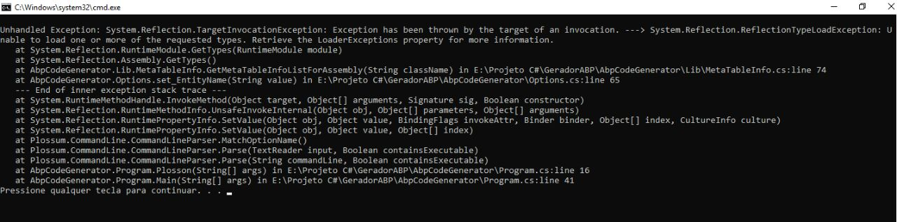
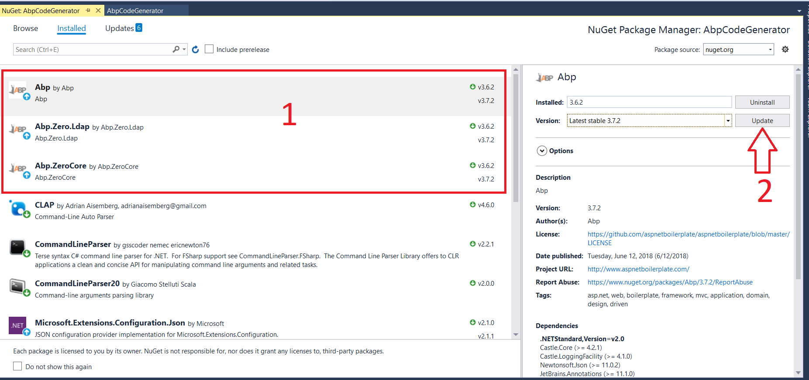
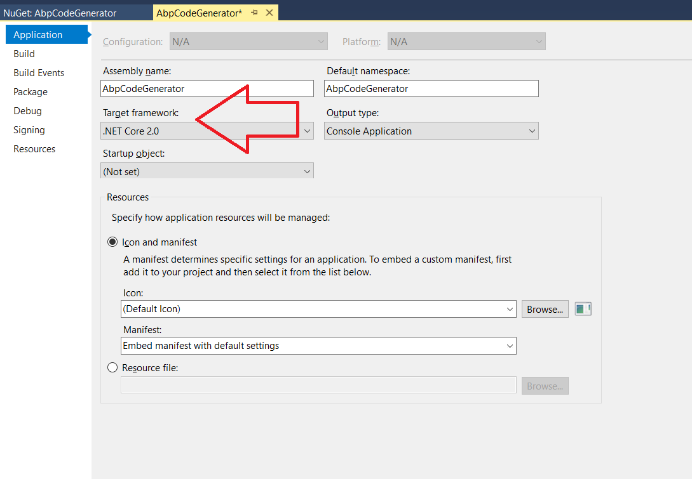

# FAQ

<!-- @import "[TOC]" {cmd="toc" depthFrom=2 depthTo=6 orderedList=false} -->

<!-- code_chunk_output -->

- [FAQ](#faq)
    - [Abp utilizado em uma versão diferente da informada no projeto [abpcodegenerator]](#abp-utilizado-em-uma-versão-diferente-da-informada-no-projeto-abpcodegenerator)
    - [Versão do Dotnet](#versão-do-dotnet)
    - [Projeto gera os artefatos, mas a solução _ABP_ deixou de funcionar](#projeto-gera-os-artefatos-mas-a-solução-_abp_-deixou-de-funcionar)

<!-- /code_chunk_output -->

## Abp utilizado em uma versão diferente da informada no projeto [abpcodegenerator]

É comum apresentar um erro ao tentar gerar para um _Entity_ disponível na solução do ABP, como a imagem apresentada a seguir:

Para corrigir este erro atualize as referências do _Abp_ no projeto do gerador através do _Nuget_. Observe que na área _**1**_, a versão instalada é a 3.6.2, mas existe a versão 3.7.2 disponível. Aperte no botão indicado pela seta _**2**_ para proceder com a atualização.

## Versão do Dotnet

Outro erro comum de acontecer é a incompatibilidade entre as versões do _.NET Framework_.

O gerador de código foi concebido com a versão ``.NET CORE 2.0 `` do _.NET Framework_. Caso necessário, realize a mudança da versão do _framework_.

## Projeto gera os artefatos, mas a solução _ABP_ deixou de funcionar

Caso este problema ocorra, verifique os erros de compilação.